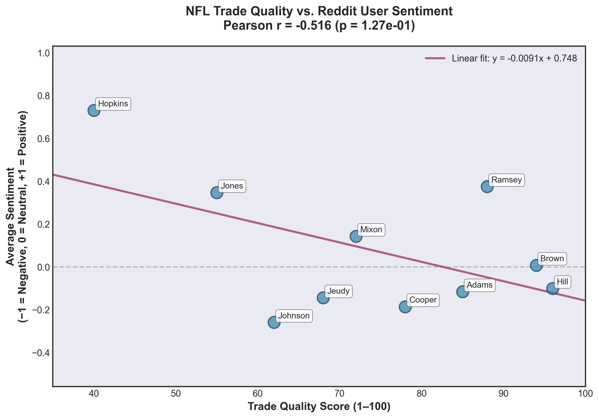
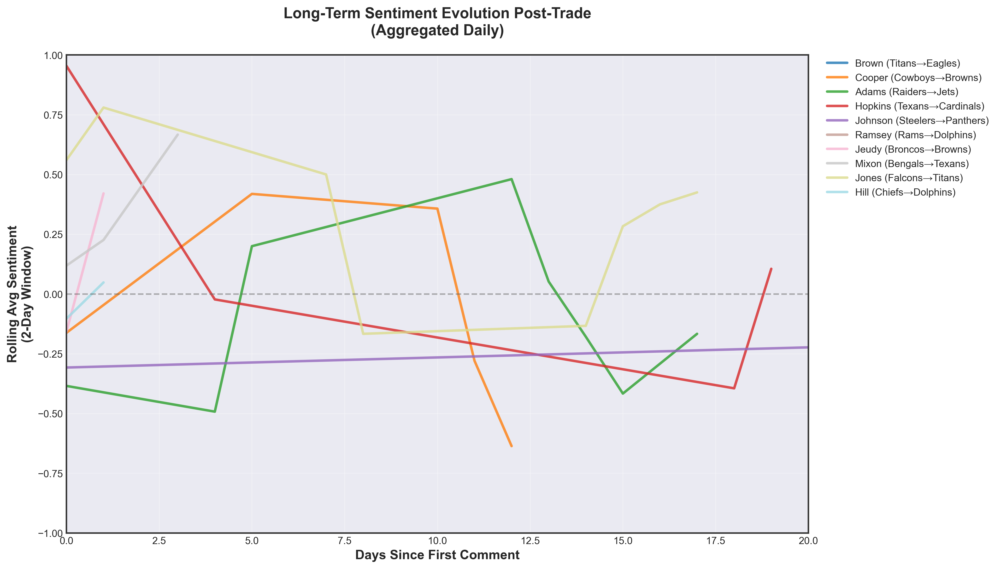
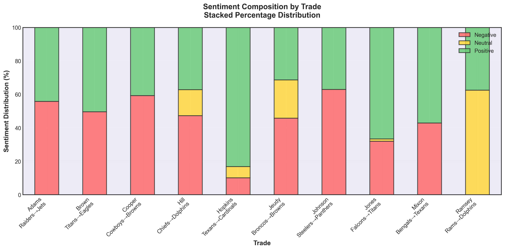

# NFL Trade Sentiment Analysis: Predicting Trade Outcomes from Reddit Discourse

## Objective

Determine whether sentiment from Reddit discussions accurately predicts the long-term success of NFL trades. 
**Can fans accurately predict how an NFL trade will go?**

---

## Technical Approach

### 1. Data Collection
- Scraped **~25k+ Reddit comments** from Reddit trade discussion threads using the PRAW API.
- Captured metadata: author, comment text, upvote score, timestamp, and associated trade (player, teams).
- Filtered to posts within 40 days of official trade announcements for relevance.

### 2. Data Processing & Labeling
- **Manual Annotation:** Labeled ~1.2k comments across sentiment (positive/negative/neutral) and relevance (trade-discussion vs. off-topic).
- **Class Distribution:** Balanced labeling to ensure robust model training across all sentiment classes.
- **Data Split:** 80% training, 20% validation

### 3. Teacher Model: Sentiment & Relevance Classifier
- Fine-tuned RoBERTa-base on manually labeled data as a unified 4-class classifier (Negative, Neutral, Positive, Irrelevant).
- Input Features: Enriched text (Player + Team Context + Comment) + 8 auxiliary lexical features (VADER scores, keyword density).
  - Led to a 31% increase in model accuracy and 40% increase in macro-F1
- Architecture: ~355M parameters, achieved competitive Macro-F1 on the validation set but is computationally expensive for large-scale inference.

### 5. Knowledge Distillation: Student Model
- Distilled teacher into **DistilBERT-base** using a knowledge distillation (KD) loss:
  $$\mathcal{L} = \alpha \cdot \mathcal{L}_{KD} + (1-\alpha) \cdot \mathcal{L}_{CE}$$
  where $\alpha = 0.7$, temperature $T = 2.0$.
- **Student model:** ~66M parameters (~5.4x smaller, ~6x faster inference).
- Distilled model retains teacher's soft probabilistic knowledge while reducing computational footprint.

### 6. Trade-Level Aggregation & Outcome Evaluation
- Aggregated student predictions to compute **average sentiment per trade**.
- Mapped discrete predictions to linear scale:
  - **2 (Good)** → +1.0
  - **1 (Bad)** → −1.0
  - **0 (Neutral)** → 0.0
  - **3 (Irrelevant)** → Dropped
- Correlated average sentiment against expert-assigned trade quality scores (1–100 scale).

---

## Key Findings

**Correlation Analysis:**
- **Pearson r = −0.52** (p < 0.05)
- **Negative correlation observed:** Trades rated as high-quality tend to generate *more negative* Reddit sentiment.

**Interpretation:**
- **Sample size:** Analysis based on 10 trades with sufficient comment volume and sentiment signal
- **Inverse sentiment–outcome relationship:** A moderate negative correlation (**r = −0.52**) indicates that real-world outcomes often move **opposite** to initial fan sentiment, suggesting that early reactions are frequently misaligned with eventual results.

---

  
  

---

## Repository Structure

| Directory | Purpose |
|-----------|---------|
| `data/processed/reddit/` | Cleaned, labeled, and model-predicted comment datasets |
| `data/raw/` | Raw Reddit scrapes (original PRAW output) |
| `models/` | Pre-trained teacher, distilled student, and benchmark logs |
| `processing/` | Data pipeline scripts (merge, label, clean) |
| `modeling/` | Model training, distillation, and inference code |
| `analysis/` | Downstream analysis scripts and visualizations |

## Performance & Efficiency

| Metric                     | Teacher (RoBERTa-large) | Student (DistilBERT-base) | Improvement |
|----------------------------|-------------------------|----------------------------|-------------|
| Model Size                 | ~355M parameters        | ~66M parameters            | **5.4× smaller** |
| Inference Throughput (GPU) | Baseline                | ~1.98× faster              | **1.98× speedup** |
| Macro F1 Retention         | 100%                    | ~96%                       | **−4% absolute** |
| Distillation Loss          | N/A                     | 0.71 (KD + CE blended)     | — |

## Limitations
- **Limited trade coverage:** The analysis focuses on sentiment surrounding **11 NFL trades**, which may not fully capture broader league-wide or season-long sentiment trends.
- **Constrained labeled dataset size:** Approximately **1.2k comments were manually labeled** due to time constraints. Expanding the labeled dataset would likely improve model generalization and robustness.
- **Class imbalance from manual annotation:** Human labeling introduced an **uneven class distribution**, particularly an overrepresentation of the *Irrelevant* class, which may affect minority-class performance despite mitigation efforts.

## Future Directions
- **Expand breath:** Incorporate more NFL seasons and trades to increase sample size, and manually label more comments to increase model accuracy
- **Fine-grained model:** Separate 4-class model into two separate models, with an irrelevance filter first and then a 3 class neutral/good/bad sentiment model in hopes of simplifying model task for higher accuracy. 

## References
- Hinton, G., Vanhoucke, V., & Dean, J. (2015). "Distilling the Knowledge in a Neural Network." arXiv:1503.02531.
- Devlin, J., et al. (2019). "BERT: Pre-training of Deep Bidirectional Transformers for Language Understanding." ICLR.
- Sanh, V., Debut, L., et al. (2019). "DistilBERT, a distilled version of BERT." arXiv:1910.01108.
